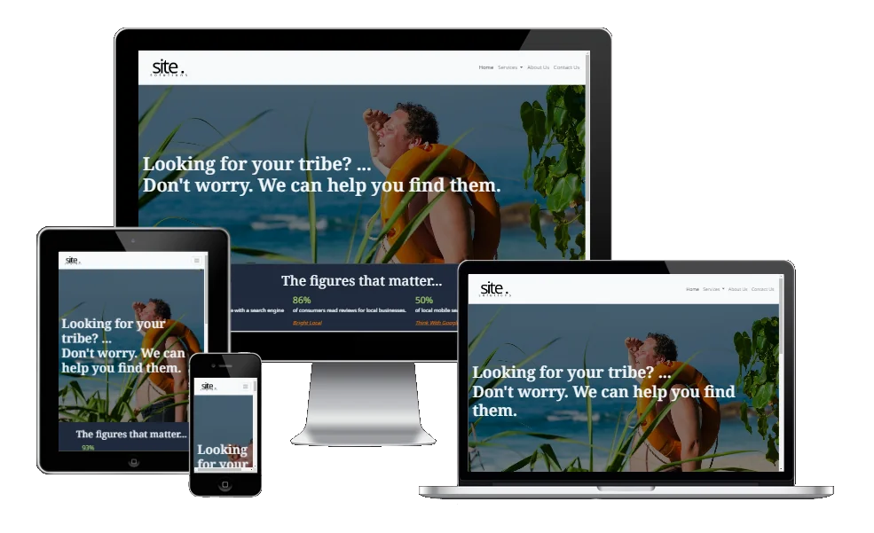
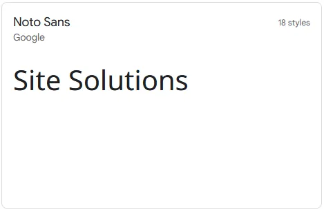
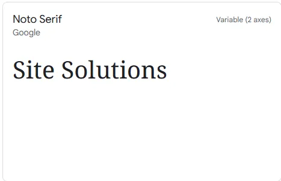

# Site Solutions Website

This is a website for the digital marketing agency, Site Solutions, that provides search engine optimisation (SEO) services to other businesses and organisations.

[View the site here.](https://cjns.github.io/Site-Solutions-Website/index.html)

## User Experience

### Client Goals (focus, definition, and value)

> 'Why are we making this product?'

> 'What is worth doing?'

- Having an online presence that displays their services.
- Increase awareness of their social media platforms using the website.
- Encouraging enquiries and leads that generate sales.
- Establishing credibility and showcase expertise in seo development.

> 'What are we creating?'

- A website to increase their online presence and aid the above goals.

> 'What value does it provide?'

- Recurring and non-recurring revenue.
- Brand awareness.
- An increased customer base and network of professional businesses.

### Success Metrics

The following metrics can be measured to track the website's success.

- Site visits.
- Contact form submissions.
- Online sales.

### Target Audience

Site Solutions is targeting the following audience:

- Small to medium business owners looking to improve their search engine listings with paid and/or organic search.

### Other considerations

- Is the content culturally appropriate?
- Is the content relevant?
- Can we track and catalogue the content in an intuitive way?
- Is the technology appropriate?
- Why are we so special?
- What tech considerations?
- Why would a user want this?
- Who is the target audience?
- What experiences are compelling them?
- How is the offering different from both competitors and substitutes?

### User Needs/Stories

> What do our users want to get out of it?

### First Time Visitor Goals

- I want to find out what Site Solutions does and how they can help my business grow.
- I want to be able to navigate the site easily to find the information I need.
- I want to see examples of their previous work and success stories.
- I want to find their contact information and a way to get in touch with them.

### Returning Visitor Goals

- I want to find updated information about their services and any new offerings.
- I want to check out their blog for helpful tips and industry news.
- I want to be able to easily contact Site Solutions with any questions I might have.

### Frequent Visitor Goals

- I want to stay informed about new blog posts and industry insights.
- I want to be able to quickly access any new services or offerings they provide.
- I want to have the option to sign up for a newsletter or follow them on social media for updates and promotions.

### Strategic Trade-offs

> How crucial is it that we solve this problem for the business?

> How realistic is it that we can implement a solution?

The table below shows which client/user goals are the most important and feasible to solve at this time based on a score out of five (five being the most important/viable).

| Opportunity/Problem                                                              | Importance | Viability/Feasibility | Result                              | Possible Solution(s)                     |
| -------------------------------------------------------------------------------- | ---------- | --------------------- | ----------------------------------- | ---------------------------------------- |
| 1. Find out about Site Solutions.                                                | 5          | 5                     | UX Efforts must address these       | About us info.                           |
| 2. Follow Site Solutions for updates and promotions.                             | 5          | 5                     | UX Efforts must address these       | Social Media info.                       |
| 3. Have contact info. available to encourage enquiries/leads.                    | 5          | 5                     | UX Efforts must address these       | Contact info.                            |
| 4. Establishing credibility and showcase expertise in seo.                       | 5          | 4                     | UX Efforts should accommodate these | Case studies & testimonials.             |
| 5. Provide quick access to services and explain how they help businesses grow.   | 5          | 5                     | UX Efforts must address these       | Product/Service information.             |
| 6. Providing industry insights                                                   | 5          | 1                     | Unwise use of time to address these | Blog/Email marketing/Newsletter service. |
| 7. Measuring success metrics                                                     | 5          | 1                     | Unwise use of time to address these | Google Tag Manager / Google Analytics.   |
| 8. I want to be able to navigate the site easily to find the information I need. | 5          | 5                     | UX Efforts must address these       | Nav. bar.                                |
| Total                                                                            | 40         | 31                    |                                     |                                          |

1. Find out about Site Solutions.
   - The act of creating a website gives Site Solutions an online platform to tell their users who they are and what they do.
2. Follow Site Solutions for updates and promotions.
   - An intuitive site that focuses on making the services clear and easily understandable will satisfy this. Links to Site Solutions social media accounts allow engagement on different platforms.
3. Have contact info. available to encourage enquiries/leads.
   - I can create a dedicated contact page that includes all of the details a user needs to contact Site Solutions.
4. Establishing credibility and showcase expertise in seo.
   - I can include previous user testimonials to increase social proof. However, implementing a 3rd party service like Google Reviews or Trust Pilot would be considered a more reliable indicator for a future implementation.
5. Provide quick access to services and explain how they help businesses grow.
   - Make sure the service pages can be located easily and have a section on the landing page that advertises the most popular services/products.
6. Providing industry insights
   - At some stage Site Solutions could invest resources into maintaining a blog or creating a marketing campaign to grow their brand and provide clients with updates and promotions. However, due to time and resource constraints this would be a future implementation.
7. Measuring success metrics
   - Site Solutions should integrate a way of measuring their success metrics as soon as possible. However, due to time and resource constraints this would be a future implementation.
8. I want to be able to navigate the site easily to find the information I need.
   - An intuitive navigation bar that maintains consistent styling and responsiveness over mobile, tablet, and desktop devices.

## Features

> What are we going to make?

- Navigation bar

  - Opportunity/Problem addressed: 8. I want to be able to navigate the site easily to find the information I need.
  - Further Details:
    - Maintain the same style and layout throughout the site.
    - A responsive navigation bar at the top of the site that allows the user to access the main pages of the website.
    - Contains a telephone number on mobile and desktop for ease of calling.
    - The site logo will be situated on the left.
    - The nav links will be positioned to the right and on smaller devices the nav menu will reduce to a burger menu bar to keep the experience tidy, intuitive, and maintain common convention.

- Home page

  - Opportunity/Problem addressed: 5. Provide quick access to services.
  - Further details:
    - A landing page image with a caption that engages the user. E.g. 'Can your users find you?'
    - A section that increases social proof by providing some key information the client will be interested in. E.g. Number of clients they have helped, how much revenue they have generated, etc.
    - An 'our services' section highlighting the main services/packages they are looking to sell. The services will link to their respective 'service page'.

- Service Pages (SEO and Social Media)

  - Opportunity/Problem addressed: 5. Provide quick access to services.
  - Further details:
    - The service pages will include more detailed information about the relevant service they have clicked on to ensure the user has all of the information they require to make a purchase decision.

- About page

  - Opportunity/Problem addressed: 1. Find out about Site Services, 4. Establishing credibility and showcase expertise in seo.
  - Further details:
    - Information about Site Solutions where client testimonials and reviews can be integrated for increased social proof.

- Contact/Sign up page

  - Opportunity/Problem addressed: 3. Have contact info. available to encourage enquiries/leads.
  - Further details:
    - The contact form will allow the user to contact Site Solutions about any of the services being offered or any other queries they may have.
    - The contact form will include the following fields.
      - Name
      - email
      - Services (dropdown)
        - SEO
        - Social Media
      - Message (text)
      - Submit

- Footer
  - Opportunity/Problem addressed: 2. Follow Site Solutions for updates and promotions.
  - Further details:
    - The footer will maintain the same style and layout throughout the site.
    - Includes links to the relevant social media sites in a new window.
    - Font Awesome icons will be used so social media sites are easily identifiable.

### Future implementations

| Future implementation                                                        | Opportunity/Problem                               |
| ---------------------------------------------------------------------------- | ------------------------------------------------- |
| Blog.                                                                        | Follow Site Solutions for updates and promotions. |
| Email marketing.                                                             | Follow Site Solutions for updates and promotions. |
| Contact form CAPTCHA.                                                        | Reduce contact form spam.                         |
| Integrate 3rd party review platforms (Google My Business, Trustpilot, etc.). | Establish credibility.                            |
| Integrate a chat application for instant communication.                      | Easily contactable.                               |
| Frequently Asked Questions (FAQ) page.                                       | Filter unqualified leads.                         |
| Google Tag Manager/Google Analytics.                                         | Track advertising return on investment (ROI).     |

### Accessibility

- Using semantic HTML.
- Using descriptive alt attributes with images.
- Ensuring sufficient colour contrast.
- Providing information for screen readers where appropriate (e.g. aria-labels).

## Design

### Sitemap

[View the sitemap here](assets/images/readme/site-map.webp)

The highest priority links will start on the left with diminishing priority links moving to the right in the following order imitating the natural customer journey from discovery to sale.

1. Home - The home/landing page will draw the users attention with key information.
2. Services - Users can see detailed information about the products.
3. About - Users can read about Site Solutions and see existing testimonials to increase social proof.
4. Contact - Users can contact Site Solutions.

### Wireframes/Skeleton Layout

- [Home](assets/images/readme/wireframe-home-page.webp)
- [About Us](assets/images/readme/wireframe-about-us.webp)
- [Service](assets/images/readme/wireframe-service-page.webp)
- [Contact](assets/images/readme/wireframe-contact-page.webp)

### Colour Scheme

The website uses a cool palette based on shades of blue and was selected using https://colorhunt.co.

- Pros
   - Limited and clean colour palette.
- Cons
   - Might be too limiting and void of color.
   - Difficult to create enjoyable contrasting colours.
   
### Reflecting on the colour scheme.

I discovered that the colour scheme was too clean and corporate and hard to integrate with additional colours. If I were to choose again, I would pick something that allowed for more creativity.

### Typography

I decided to use [Google Noto](https://fonts.google.com/noto/) fonts. Specifically the Noto Sans font for the body text with a fall back of sans-serif. The Noto Serif was used for the headings with serif as the fall-back font.

- Pros
   - Comprehensive language support: Noto fonts a wide range of languages and scripts making them great for visual harmony with compatible heights and stroke thicknesses among the many different languages.
   - Open-source and free to use.
   - High-quality design by Google.
   - Good legibility. They are designed to be easily readable on screens making them suitable for web.
   - Easy to use with Google fonts. You can easily integrate the fonts into your web project with [Google Fonts](https://fonts.google.com/).
- Cons
   - Local implementation: Finding the woff2 files to host locally took a bit of detective work. However, importing or using `<link>` to load the css is quite simple.
   - Limited font variations: Noto Sans and Noto Serif come in various weights but do not offer much with stylistic variations.
   - Overuse: They do not provide a unique or distinctive look where less common fonts may excel.

### Font Implementation

I initially used `@import` to load the Noto fonts. However, this produced some 'opportunities' in lighthouse to improve the performance aspect of my site since `@import` defers the loading of the file until it is fetched, which negatively impacts performance by blocking the rendering of the page until the fonts are loaded. This led me to experiment with using `<link>` to access Google Fonts but I wanted to decrease potential latency even further.

After a bit of searching, I was able to manually download the woff2 files and self host the [Noto Sans font](https://fonts.googleapis.com/css2?family=Noto+Sans:wght@100;200;300;400;500;600;700;800;900&family=Noto+Serif:wght@100;200;300;400;500;600;700;800;900&display=swap%22%20rel=%22stylesheet) and the variable font file for [Noto Serif](https://fonts.googleapis.com/css2?family=Noto+Serif:wdth,wght@62.5..100,100..900&display=swap), which positively impacted the performance.

### Effects

### Imagery

### Reinforce the meaning of content

### Guide the user through tasks and information

### Minimise cognitive overload and maximise intuitive learning

### Appropriate content

## Technologies used

### Languages used

- [HTML](https://html.spec.whatwg.org/multipage/)
- [CSS](https://www.w3.org/Style/CSS/)

### Frameworks, Libraries, and Programs used

- [Am I Responsive](https://ui.dev/amiresponsive/): Images of responsive design.
- [Balsamiq](https://balsamiq.com/): Wireframing.
- [Bootstrap 5.3](https://getbootstrap.com/): Bootstrap Navigation.
- [Canva](https://www.canva.com/en_gb/): For creating the site logo.
- [Chrome Developer Tools](https://developer.chrome.com/docs/devtools/): Testing and debugging.
- [favicon.io](https://favicon.io/): For generating favicon.
- [Font Awesome](https://fontawesome.com/): For icons.
- [GNU Image Manipulation Program (GIMP)](https://www.gimp.org/): Image editing and conversion.
- [Git](https://git-scm.com/): For version control and pushing to Github.
- [GitHub](https://github.com/): To store projects in a public repository.
- [GitHub Desktop](https://desktop.github.com/): Desktop software to simplify the Git/Github development workflow.
- [Google Fonts](https://fonts.google.com/): Google Noto Fonts.
- [Pexels](https://www.pexels.com/): For images.
- [sitemaps.org](https://www.sitemaps.org/protocol.html): For reviewing the sitemap XML schema.
- [Unsplash](https://unsplash.com/): For images.
- [VSCode](https://code.visualstudio.com/): Coding text editor.
- [Web accessibility evaluation tool (WAVE)](https://wave.webaim.org/): For testing site accessibility quality.

## Testing

Please see the [testing.md](./testing.md) file for the testing process.

## Deployment & Local Development

VSCode and Github Desktop were used for local development and pushing code to GitHub.

### Github Pages

1. Sign up and log into GitHub.
2. Select the project repository.
3. Click the settings link.
4. Within the left panel, under 'Code and automation', click 'Pages'.
5. Within the main window, under 'Build and deployment', select deploy from a branch.
6. Within the main window, under 'Branch', use the main branch and use the /root folder.
7. Save settings.

### Forking the Github Repository

1. Log into GitHub.
2. Go to the [Site-Solutions-Website](https://github.com/cjns/Site-Solutions-Website) repository.
3. Select the 'Fork' button in the top right corner under your profile icon.

### Making a Local Clone

1. Log into GitHub.
2. Navigate to the repository you want to clone.
3. Select the '<> Code' and copy the link for your preferred method of cloning the site.
4. Use your terminal to navigate to the working directory you want use.
5. Type `git clone` into the terminal and paste the link you copied in step 3 and press enter.

## Credits

### Media
- [index.html hero image](https://www.pexels.com/photo/orange-safety-ring-on-man-shoulder-near-body-of-water-319930/)
- [about.html background image](https://unsplash.com/photos/5U_28ojjgms)

### Acknowledgements
- My mentor Graeme Taylor.
- My tutor Callum Jones.
- Code Institute, their resources, and tutor support.